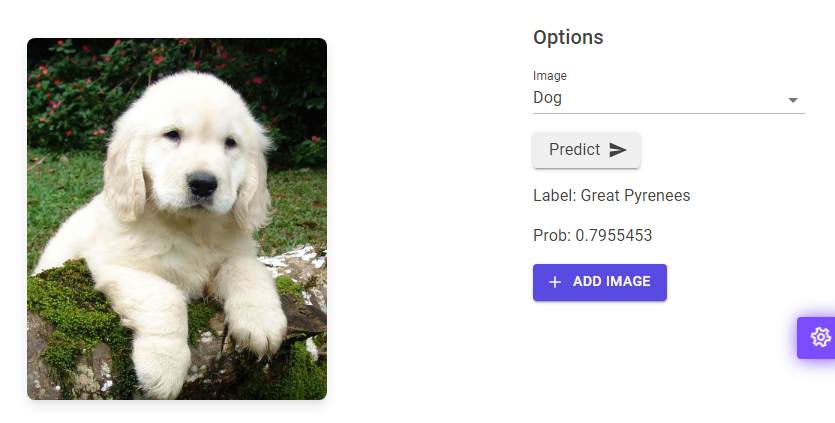

# BlazorMLWebApp

This is a demonstration of running a machine learning model on a **Blazor Web App**.
Here, the task is simply to classify images.

## Demo

  

## Features

For image inference, the [ONNX files](https://github.com/onnx/models/tree/main/vision/classification/squeezenet) for the SqueezeNet model trained on the ImageNet dataset are used.ONNX files are used to infer the images.

## Dependencies

Package and Version

* MudBlazor 6.0.17
* Microsoft.ML 1.7.1
* Microsoft.ML.ImageAnalytics 1.7.1
* Microsoft.ML.OnnxRuntime 1.13.1
* Microsoft.ML.OnnxTransformer 1.7.1

See BlazorMLWebApp.csproj for more details.

## Usage

```bash
git clone https://github.com/napnel/BlazorMLWebApp.git
cd BlazorMLWebApp
dotnet watch run (or dotnet run)
```

Open <https://localhost:7038/>

## Note

It has been developed with Visual Studio Code.
